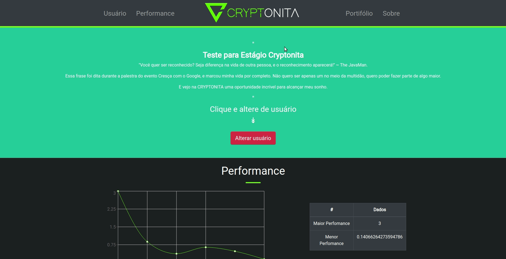

## Introdução
Projeto realizado para seleção de cargo, FullStack Developer, na Startup Cryptonita - Copy Trading Crypto (https://cryptonita.org/).

    
    * O período para conclusão do projeto era 4 dias. Na época, desempenhava papel ativo na área de infraestrutura, sendo desenvolvimento aplicado apenas no curso técnico - COTEMIG.
    
    Durante o período dediquei-me ao máximo para aprender sobre o funcionamento do Javascript, REACTJS💕 e NODEJS, juntamente com GIT e o GITHUB, sendo recompensado com a vaga de trabalho.

    A partir deste desafio despertei a vontade de seguir na área de desenvolvimento!

## Instalação
- npm install
- npm start

## Descrição
Esta pequena aplicação em React faz uma requisição ao endpoint http://localhost:8080/performance/1
e popula um gráfico de linha com os resultados

O gráfico representa a evolução do saldo de um cliente da Cryptonita.

## Desafio
O desafio aqui é fazer um outro componente para mostrar o portfólio do cliente da Cryptonita em um gráfico de Pizza.

## Observações
Último commit feito para corrigir erros de gramática.